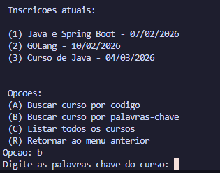
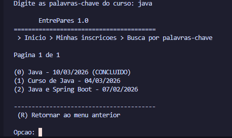

# Relatório do Trabalho Prático 03 - AEDS III

Link do Vídeo da Plataforma no YouTube: [TP03-VIDEO](https://youtu.be/1j8hmA_RMUQ)

## Participantes

- Davi Rafael de Oliveira Gurgel Martins
- Pedro Augusto Gomes de Araújo

## Descrição geral do sistema

O sistema desenvolvido é uma aplicação Java em modo console chamada `EntrePares 1.0`, voltada para o gerenciamento de usuários, cursos e inscrições em cursos. A proposta principal do sistema é permitir que usuários se cadastrem, acessem o sistema por login, criem cursos, gerenciem seus próprios cursos e se inscrevam em cursos criados por outros usuários.

No TP03, além das funcionalidades já existentes de cadastro, autenticação, gerenciamento de cursos e inscrições, foi implementada a busca de cursos por palavras-chave. Essa busca utiliza um índice invertido criado a partir dos termos presentes nos nomes dos cursos. Dessa forma, o usuário não precisa saber exatamente o código compartilhável do curso para encontrá-lo, podendo localizar cursos a partir de uma ou mais palavras relacionadas ao nome.

O projeto segue uma organização em camadas, separando modelos, armazenamento, regras de controle e visões de tela. A classe `Main` inicializa os principais componentes do sistema, instancia as visões, os arquivos de armazenamento e os controladores, além de fazer a injeção das dependências entre usuários, cursos e inscrições.

O sistema permite:

- cadastrar, autenticar, editar, recuperar senha e excluir usuários;
- cadastrar cursos associados ao usuário logado;
- listar e gerenciar os cursos criados pelo usuário;
- alterar dados, data e estado de um curso;
- buscar cursos de outros usuários por código compartilhável;
- buscar cursos de outros usuários por palavras-chave no nome do curso;
- listar cursos disponíveis de outros usuários;
- realizar inscrições em cursos;
- listar as inscrições feitas pelo usuário;
- cancelar inscrições;
- gerenciar os usuários inscritos em um curso criado pelo usuário;
- exportar a lista de inscritos de um curso para arquivo CSV;
- manter índices em arquivos usando Hash Extensível, Árvore B+ e Lista Invertida.

## Classes criadas

### Classe principal

- `TP03.Main`

### Models

- `TP03.models.Registro`
- `TP03.models.Usuario`
- `TP03.models.Curso`
- `TP03.models.CursoUsuario`

### Controllers

- `TP03.controllers.ControleUsuario`
- `TP03.controllers.ControleCurso`
- `TP03.controllers.ControleInscricao`

### Views

- `TP03.views.VisaoUsuario`
- `TP03.views.VisaoCurso`
- `TP03.views.VisaoInscricao`
- `TP03.views.VisaoInscritos`

### Storage e índices

- `TP03.storage.Arquivo`
- `TP03.storage.ArquivoUsuario`
- `TP03.storage.ArquivoCurso`
- `TP03.storage.ArquivoInscricao`
- `TP03.storage.HashExtensivel`
- `TP03.storage.ArvoreBMais`
- `TP03.storage.ListaInvertida`
- `TP03.storage.ElementoLista`
- `TP03.storage.RegistroHashExtensivel`
- `TP03.storage.RegistroArvoreBMais`
- `TP03.storage.ParIDEndereco`
- `TP03.storage.ParEmailID`
- `TP03.storage.ParCodigoID`
- `TP03.storage.ParUsuarioCurso`
- `TP03.storage.ParCursoID`
- `TP03.storage.ParUsuarioID`

### Testes utilitários

- `TP03.utils.TesteUsuario`
- `TP03.utils.TesteCurso`

## Organização dos dados

Os dados são armazenados em arquivos binários no diretório `TP03/dados`. Cada entidade principal possui seu próprio arquivo de dados e arquivos auxiliares de índice.

Usuários:

- arquivo principal: `TP03/dados/usuarios/usuarios.db`;
- índice direto por ID: `usuarios.d.db` e `usuarios.c.db`;
- índice indireto por e-mail: `indiceEmail.d.db` e `indiceEmail.c.db`.

Cursos:

- arquivo principal: `TP03/dados/cursos/cursos.db`;
- índice direto por ID: `cursos.d.db` e `cursos.c.db`;
- índice indireto por código compartilhável: `indiceCodigo.d.db` e `indiceCodigo.c.db`;
- Árvore B+ para associar usuário e curso: `arvoreCursos.db`;
- índice invertido por nome do curso: `indiceNome.dic.db` e `indiceNome.blocos.db`.

Inscrições:

- arquivo principal: `TP03/dados/inscricoes/inscricoes.db`;
- índice direto por ID: `inscricoes.d.db` e `inscricoes.c.db`;
- Árvore B+ por curso: `arvoreCurso.db`;
- Árvore B+ por usuário: `arvoreUsuario.db`.

## Funcionamento das principais entidades

### Usuário

A entidade `Usuario` representa uma pessoa cadastrada no sistema. Ela possui ID, nome, e-mail, hash da senha, pergunta secreta e hash da resposta secreta. O controle de usuários permite cadastro, login, edição de dados, alteração de senha, recuperação de senha e exclusão da conta.

O e-mail é indexado por Hash Extensível, permitindo localizar rapidamente um usuário pelo e-mail durante o login e a recuperação de senha.

### Curso

A entidade `Curso` representa um curso cadastrado por um usuário. Ela possui ID, nome, data de início, descrição, código compartilhável, estado e ID do usuário criador.

Os estados implementados são:

- `ATIVO_INSCRICOES`: curso ativo e recebendo inscrições;
- `ATIVO_SEM_INSCRICOES`: curso ativo, mas sem aceitar novas inscrições;
- `CONCLUIDO`: curso finalizado;
- `CANCELADO`: curso cancelado.

Cada curso recebe um código compartilhável gerado automaticamente. Esse código funciona como um identificador curto para que outros usuários encontrem o curso diretamente.

### CursoUsuario

A entidade `CursoUsuario` representa a associação entre usuários e cursos. Cada registro possui:

- ID próprio da inscrição;
- ID do curso;
- ID do usuário;
- data da inscrição.

Essa classe é armazenada pelo `ArquivoInscricao`, que implementa as operações de criação, leitura e exclusão das inscrições, além de consultas por curso e por usuário.

### ElementoLista

A classe `ElementoLista` representa um item armazenado na lista invertida. Cada elemento possui o ID do curso e a frequência do termo no nome do curso. Essa frequência é usada na pontuação da busca por palavras-chave.

## Operações especiais implementadas

### Hash Extensível como índice direto

A classe genérica `Arquivo<T>` usa `HashExtensivel<ParIDEndereco>` como índice direto. Esse índice associa o ID de cada registro ao endereço físico do registro no arquivo binário. Isso evita a necessidade de percorrer todo o arquivo para localizar um registro por ID.

### Reaproveitamento de espaço com lápides

Os registros removidos são marcados com lápide (`*`) e seus espaços entram em uma lista de removidos. Ao criar ou atualizar registros, o sistema tenta reaproveitar esses espaços antes de gravar no final do arquivo.

### Índice por e-mail

A classe `ArquivoUsuario` usa `HashExtensivel<ParEmailID>` para associar o e-mail do usuário ao seu ID. Isso é usado principalmente no login, na recuperação de senha e na exclusão por e-mail.

### Índice por código compartilhável do curso

A classe `ArquivoCurso` usa `HashExtensivel<ParCodigoID>` para associar o código compartilhável do curso ao ID do curso. Essa estrutura permite a busca direta de cursos por código.

### Árvore B+ para cursos por usuário

A classe `ArquivoCurso` usa uma `ArvoreBMais<ParUsuarioCurso>` para relacionar o ID do usuário criador com os IDs dos cursos criados por ele. Isso permite listar os cursos pertencentes ao usuário logado.

### Duas Árvores B+ para inscrições

A classe `ArquivoInscricao` usa duas árvores B+:

- `ArvoreBMais<ParCursoID>`: permite encontrar as inscrições de um determinado curso;
- `ArvoreBMais<ParUsuarioID>`: permite encontrar as inscrições de um determinado usuário.

Essa solução atende ao relacionamento entre usuários e cursos, pois permite consultar a associação nos dois sentidos: cursos de um usuário e usuários inscritos em um curso.

### Índice invertido por nome de curso

A principal operação especial do TP03 foi a criação do índice invertido para os termos dos nomes dos cursos. Esse índice foi implementado usando a classe `ListaInvertida`, instanciada dentro da classe `ArquivoCurso` pelo atributo `indiceInvertidoNome`.

Ao criar um curso, o sistema chama o método `indexarNomeCurso`. Nesse processo, o nome do curso é normalizado, convertido para letras minúsculas, tem os acentos removidos e é separado em termos. Depois disso, o sistema remove números e palavras muito comuns, chamadas de stop words, como artigos e preposições. Os termos restantes são inseridos na `ListaInvertida`, associados ao ID do curso e à frequência do termo no nome.

Quando um curso é atualizado, o sistema verifica se o nome antigo é diferente do nome novo. Se houver alteração, os termos antigos são removidos do índice e os novos termos são inseridos. Quando um curso é excluído, seus termos também são removidos do índice invertido.

### Busca por palavras-chave

A busca por palavras-chave foi implementada no menu de inscrições. Na classe `VisaoInscricao`, o usuário encontra a opção `Buscar curso por palavras-chave`. Essa opção chama o método `buscarPorPalavras` na classe `ControleInscricao`.

O método `buscarPorPalavras` solicita os termos ao usuário e chama `ArquivoCurso.readPorPalavras`. Esse método consulta a `ListaInvertida`, recupera os cursos associados aos termos digitados, calcula uma pontuação de relevância usando frequência do termo e IDF, soma pontuações quando o curso aparece em mais de um termo e ordena os resultados em ordem decrescente de relevância.

Depois da busca, o sistema filtra os cursos do próprio usuário, evitando que ele tente se inscrever em cursos criados por ele mesmo. Em seguida, os resultados são exibidos em uma lista paginada.

### Integridade das inscrições

O sistema impede que um usuário se inscreva em um curso próprio. Também verifica se o curso está com inscrições abertas antes de permitir a inscrição. Além disso, verifica se o usuário já está inscrito no curso, evitando inscrições duplicadas.

### Gestão de inscritos pelo criador do curso

Na visão de cursos, o usuário criador pode abrir a lista de inscritos de um curso, visualizar os dados dos inscritos, cancelar uma inscrição e exportar a lista de inscritos para CSV.

### Exportação para CSV

A classe `ControleCurso` possui a operação de exportação da lista de inscritos para o arquivo `TP03/inscritos.csv`. O arquivo contém informações dos usuários inscritos no curso, facilitando a consulta fora do sistema.

### Ordenação e paginação

Na visão de inscrições, a listagem geral de cursos apresenta paginação de 10 itens por página. Os cursos são ordenados por data de início. Na busca por palavras-chave, os resultados são ordenados por relevância, considerando a pontuação calculada a partir dos termos encontrados no índice invertido.

## Telas do sistema

### Figura 1 - Busca Por Palavra Chave



### Figura 2 - Resultado da Busca por Palavra Chave



## Checklist obrigatório

**O índice invertido com os termos dos nomes dos cursos foi criado usando a classe ListaInvertida?**

Sim. A classe `ArquivoCurso` possui o atributo `ListaInvertida indiceInvertidoNome`, inicializado com os arquivos `indiceNome.dic.db` e `indiceNome.blocos.db`. A indexação dos nomes dos cursos é feita pelos métodos `indexarNomeCurso`, `removerNomeCursoDoIndice` e `readPorPalavras`.

**É possível buscar cursos por palavras no menu de inscrição?**

Sim. No menu de inscrições, implementado na classe `VisaoInscricao`, existe a opção `Buscar curso por palavras-chave`. No controle, essa opção chama o método `buscarPorPalavras`, que utiliza o método `readPorPalavras` da classe `ArquivoCurso`.

**O trabalho compila corretamente?**

Sim. O projeto foi compilado com o comando abaixo, usando todos os arquivos `.java` do TP03:

```bash
javac TP03/Main.java TP03/models/*.java TP03/storage/*.java TP03/controllers/*.java TP03/views/*.java TP03/utils/*.java
```

A compilação terminou sem erros.

**O trabalho está completo e funcionando sem erros de execução?**

Sim. As funcionalidades solicitadas para o TP03 estão implementadas no código: cadastro e login de usuários, gerenciamento de cursos, busca por código, busca por palavras-chave usando índice invertido, inscrições, cancelamento de inscrições, gerenciamento de inscritos e exportação em CSV. Antes da entrega final, recomenda-se apenas executar novamente os fluxos principais no ambiente local do grupo para conferir os prints que serão anexados ao relatório.

**O trabalho é original e não a cópia de um trabalho de outro grupo?**

Sim. O trabalho foi desenvolvido pelo grupo, com classes próprias para modelos, controladores, visões e armazenamento, utilizando as estruturas de dados estudadas na disciplina e adaptando-as às funcionalidades solicitadas para o sistema.

## Conclusão

O TP03 amplia o sistema `EntrePares 1.0` com a busca de cursos por palavras-chave. O principal destaque do trabalho é a criação do índice invertido para os termos dos nomes dos cursos, permitindo que o usuário encontre cursos por palavras relevantes em vez de depender apenas do código compartilhável.

Além disso, o sistema mantém as funcionalidades de gerenciamento de usuários, cursos e inscrições, usando Hash Extensível, Árvore B+ e Lista Invertida para organizar os dados e permitir consultas por diferentes chaves. Dessa forma, o trabalho atende ao objetivo proposto e o relatório apresenta as classes criadas, as operações especiais implementadas e o checklist obrigatório para facilitar a correção.
